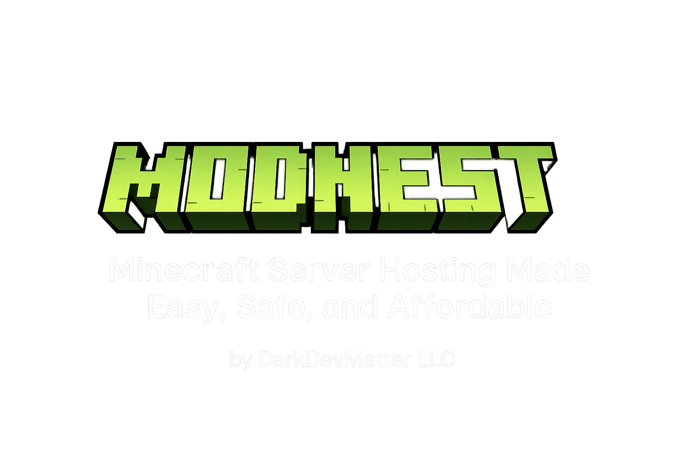
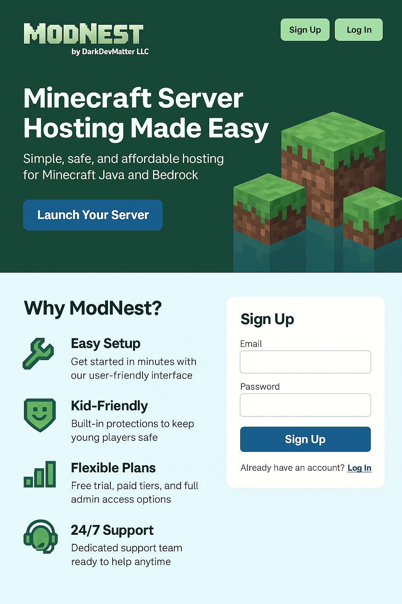
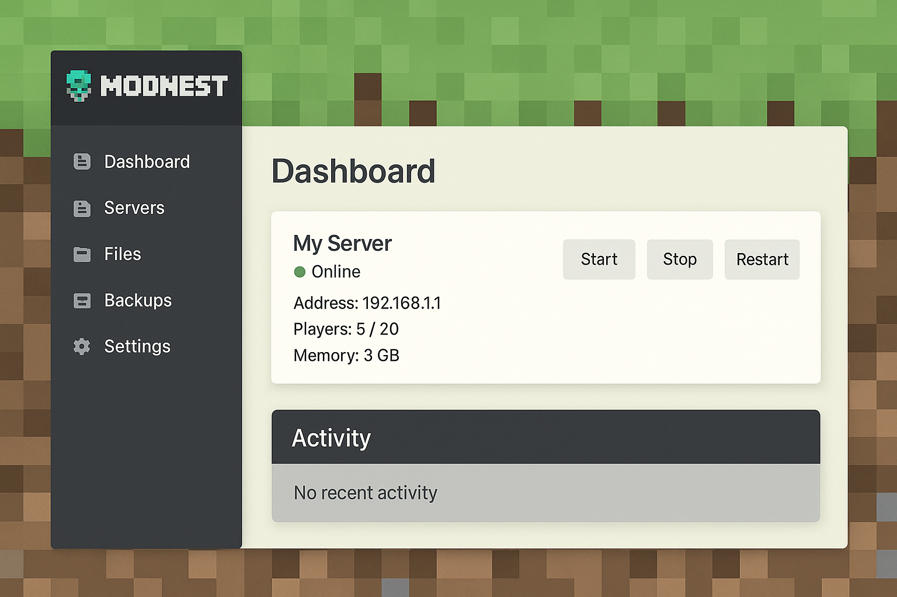

  

<!-- *Minecraft Server Hosting Made Easy, Safe, and Affordable*  
by DarkDevMatter LLC -->
<!-- A_PowerPoint_presentation_cover_slide_for_"ModNest.png" -->
---

## The Problem
- **Technical Barriers:** Setting up and managing a Minecraft server requires knowledge of Java, mods, networking, and security. Most families and kids find this overwhelming.
- **Maintenance Burden:** Upgrading servers, installing mods, updating plugins, and backing up worlds is time-consuming and error-prone, leading to lost worlds or downtime.
- **Safety Risks:** Public servers often expose kids to inappropriate content, bullying, and unsafe interactions. Few options allow real parental oversight.
- **Lack of Affordable, Kid-Friendly Options:** Most hosting platforms are designed for power users or large communities, not families or kids who just want a safe, fun place to play together.

---

## Our Solution: ModNest
- **Instant Server Creation:** Launch a modded or vanilla Minecraft server in seconds—no technical expertise required.
- **Safe by Default:** Built-in whitelisting, chat monitoring, and the option to disable public discovery. All servers can default to private.
- **Kid Mode:** Enforces parental controls, limits external communication, enables AI/NPC players, and can optionally turn off chat for extra safety.
- **Affordable & Flexible Plans:** Free trials, tiered pricing, and premium features for families, classrooms, and advanced users.
- **Parental Dashboard:** View activity logs, manage server settings, approve friends, and monitor playtime—all from an easy web portal.

---

## Key Features
- **1-Click Deploy:** Java and Bedrock support, plus auto-install for Forge, Fabric, and modpacks.
- **Modpack Marketplace:** Browse, preview, and install top modpacks with a click—curated and rated for kid-friendliness.
- **Modern Web Admin:** Start, stop, or restart servers; view logs, stats, and resource usage in real time.
- **Safe Multiplayer:** Built-in tools for whitelisting, kicking, or banning players; full control over who joins your child’s world.
- **Automated Backups & Rollbacks:** Never lose a world. Restore to previous saves instantly.
- **AI/NPC Integration:** Populate servers with friendly AI when friends are offline, so kids always have someone to play with.
- **Mobile Friendly:** All controls work seamlessly from desktop or mobile.

---

## Mock Site Preview

- **Homepage Mockup:** Shows a welcoming interface, bright colors, and a clear call to action: “Start Your Safe Minecraft Server.” Key benefits and testimonials highlighted.

  
   
  <em>Homepage Mockup</em>

---

- **Admin Panel Mockup (Simple):** Demonstrates how easy it is to manage your server—toggle power, view logs, invite friends.

  
   
  <em>Admin Panel Mockup (Simple)</em>

- **Admin Panel Mockup (Detailed):** Shows advanced controls: live console, player list (with kick/ban), resource usage graphs, modpack manager, and backup/restore options.

  
   
  <em>Admin Panel Mockup (Detailed)</em>

---

## Market Opportunity

### Minecraft’s Enormous User Base
- **Over 300 million copies sold** (as of late 2023) and **170+ million monthly active players** globally.
- Minecraft remains the **#1 best-selling game of all time**.
- Cross-platform appeal: Java, Bedrock, mobile, consoles.

### Growth of Multiplayer & Modded Play
- Multiplayer and **custom servers** are the heart of Minecraft’s long-term success.
- Tens of millions of users engage with **multiplayer servers** each month.
- **Modded Minecraft** has exploded: Modpacks like SkyFactory, Pixelmon, RLcraft, etc., see millions of downloads.
- Many younger players and families want **safe, easy, and affordable hosting**, but lack technical skills.

### Lack of Safe, Kid-Friendly Hosting
- Few (if any) mainstream Minecraft hosts offer **kid-first safety features** (chat monitoring, parental controls, easy whitelisting, or “kid mode”).
- Parents are increasingly concerned about **online safety, privacy, and inappropriate content**.
- Schools, camps, and after-school programs are adopting Minecraft for learning and community—need easy-to-use, safe hosting options.

### Hosting Market Trends
- **Global game server hosting market** is valued at over **$1.5B** in 2024 and growing 12%+ annually.
- **Minecraft server hosting** is a dominant niche, with dozens of small to mid-size providers—but very little product/brand differentiation.
- Most competitors fight on **price and specs**; almost none focus on **UX, safety, or parental controls**.

### ModNest’s Unique Angle
- **Target users:** Kids, parents, families, schools, safe community leaders, modded players, creators.
- **Product moat:** Easy setup, safe by default, strong parental tools, fun “kid mode,” attractive branding.
- **Go-to-market:** Parent groups, school partnerships, influencer/YouTube channels, kid-focused content, and modding communities.

**Summary Table:**

| Opportunity                  | Metric / Trend                                  |
|------------------------------|-------------------------------------------------|
| Minecraft players (monthly)  | 170M+                                           |
| Minecraft servers worldwide  | Millions (official + community-run)             |
| Modded MC downloads (Curse)  | 1B+ annually                                    |
| Parents/families gaming      | Fastest-growing segment in online gaming         |
| Server hosting market        | $1.5–2.5B, 12%+ annual growth                   |
| Kid-safe server providers    | <3 with real “kid mode” features                |

---

## How ModNest Works

  

- **Sign Up:** User creates a ModNest account and selects server options (modded/vanilla, Java/Bedrock, kid mode, RAM/CPU).
- **Web App on EKS:** The frontend (built in React, deployed on AWS EKS) handles all user interactions.
- **API Backend on EKS:** API securely orchestrates new server deployments, resource scaling, and user permissions, also running on AWS EKS.
- **Database & Storage:** User data, server configs, and activity logs stored in Amazon RDS; worlds and backups stored in S3.
- **Minecraft Server Pods:** Each Minecraft server runs in a secure, isolated container within Kubernetes—auto-scaled for demand, monitored for health and security.
- **Parental Tools:** Activity logs, alerts, and chat review accessible at any time.

---

## Revenue Model
- **Free Tier:** Try ModNest with limited resources—perfect for a weekend test or small friend group.
- **Starter Plans:** Affordable monthly fee for more RAM, concurrent players, or worlds.
- **Premium & Family:** Full admin/file access, modding tools, priority support, and enhanced kid mode options.
- **Classroom/Education Packages:** Bulk management, roster integration, and teacher dashboards.
- **Add-Ons:** Extra world slots, backups, modpacks, server customization, and future marketplace content.

---

## Safety & Differentiation
- **Kid Mode & Parental Controls:** Industry-first approach to keeping servers safe for children—chat filters, join approval, detailed logs.
- **No Strangers by Default:** All servers are private/whitelist-only unless parents choose to open them up.
- **Community & Education:** Focused on fun, creativity, and learning, not just gaming—encouraging STEM skills, social play, and digital citizenship.
- **Transparent & Trustworthy:** Clear privacy policies, no data sharing, parent-first support, and responsive moderation.
- **Continuous Monitoring:** AI tools review chat and server activity for safety threats or bad actors.

---

## Go-To-Market Strategy
- **Parent Groups & Schools:** Partner with PTA groups, after-school programs, and educational conferences to offer free trials and demos.
- **Influencer & Content Creator Marketing:** Collaborate with Minecraft YouTubers, family-friendly streamers, and educators to showcase safety and fun.
- **Content & SEO:** Publish tutorials, modpack reviews, parent guides, and safety tips to drive organic search and community engagement.
- **Community Partnerships:** Support coding clubs, summer camps, and local eSports leagues with special offers and teaching resources.
- **Referral Program:** Reward users for inviting friends, schools, and communities.

---

## Roadmap
- **Q2 2025:** MVP launch (Java/Bedrock, core safety features, basic admin panel)
- **Q3 2025:** Modpack marketplace, advanced kid mode, expanded parental controls, mobile app beta
- **Q4 2025:** Full admin tier, classroom management features, regional expansion, influencer campaigns
- **2026:** Marketplace for modpacks/worlds, AI features, full mobile admin, continuous platform upgrades

---

## The Team
- **Founder: Tyler Jones** — Experienced backend/devops engineer, passionate about making tech safe and accessible for kids.
- **Advisors:** Experts in cloud infrastructure, Minecraft modding, child safety online, and education technology.
- **Hiring Plan:** Frontend developers (React/Next.js), UI/UX designers, support/community managers, and marketing.
- **Community Champions:** Recruiting teachers, parents, and modders to guide product direction and moderate community.

---

## Contact / Next Steps
- **Let’s build safer, smarter Minecraft hosting—together!**
- **Contact:** your.email@darkdevmatter.com
- **Website:** modnest.com (Coming Soon)
- **Demo & Early Access:** Invite list open—get feedback from parents, teachers, and kids before public launch.

---</file>